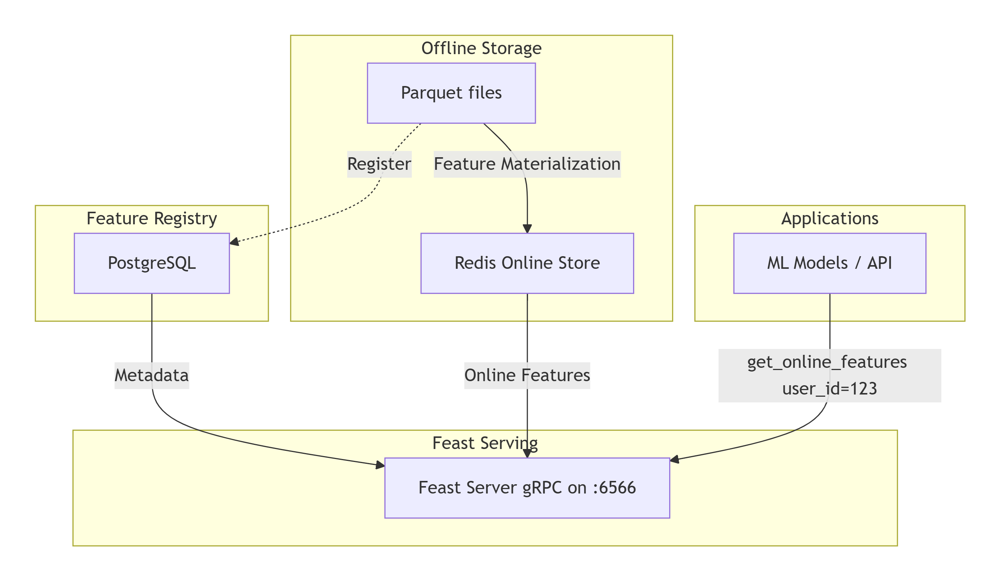
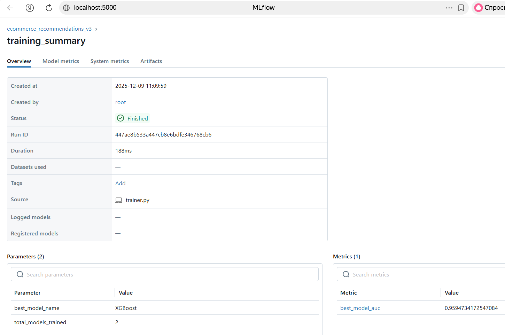

# Описание проекта
Рекомендательная система персонализированных рекомендации для e-commerce платформы.

# Бизнес сценарий и уникальный вариант
- **Цель**: персонализированные рекомендации
- **Требование 1**: Latency < 100 мс для инференса
- **Требование 2**: CTR на 10%
- **Требование 3**: Согласованность фич в offline/online
- **Требование 4 (уникальное)**: Реализовать обработку холодных стартеров

## Быстрый запуск
- **Запуск каждого задания**: Каждое задание решил выполнять в отдельных контейнерах и разбить на папки (zadanie 1, zadanie 2 ...)
docker-compose up -d

# Задание 1

## Результаты EDA с графиками
 Все графики хранятся в папке ml-production-lab4\artifacts\eda

## Таблица сравнения моделей

 Схема архитектуры системы и обоснование выбора технологии

|Name models|GradientBoosting|SVM|CatBoost|LightGBM|XGBoost|RandomForest|LogisticRegression|
|---|---|---|---|---|---|---|---|
|Name|Value|Value|Value|Value|Value|Value|Value|
|accuracy|0.948|0.339|0.941|0.948|0.94|0.924|0.923|
|f1_score|0.961|0.493|0.957|0.96|0.956|0.947|0.947|
|false_negatives|406|659|262|455|381|239|102|
|false_positives|2717|38955|3264|2681|3221|4319|4509|
|inference_time_ms|0.002|0.081|2.437e-4|0.002|6.661e-4|0.004|3.662e-5|
|precision|0.978|0.951|0.981|0.977|0.978|0.981|0.983|
|recall|0.948|0.339|0.941|0.948|0.94|0.924|0.923|
|roc_auc|0.961|0.361|0.965|0.958|0.958|0.955|0.968|
|specificity|0.954|0.338|0.945|0.954|0.945|0.927|0.923|
|training_time_seconds|207|373.6|9.543|3.31|4.091|29.87|0.431|
|true_negatives|56150|19912|55603|56186|55646|54548|54358|
|true_positives|686|433|830|637|711|853|990|

## Обоснование выбора финальной модели 

LightGBM выбрана как финальная модель благодаря оптимальному сочетанию:

- **Высокая точность предсказаний** (accuracy: 0.948, F1-score: 0.960)
- **Экстремальная скорость инференса** (0.002 мс на один запрос)
- **Эффективное использование ресурсов** (обучение за 3.31 секунды)
- **Хорошая поддержка категориальных данных**
- **Удовлетворение всех бизнес-требований**

## Скриншот MLflow UI с экспериментом

# Задание 2: Реализация Feature Store

## Архитектура Feature Store

## Код реализации фич

### Определение сущностей и признаков (`feature_repo/definitions.py`)
Созданы три основных Feature View:
-   **user_stats_view**: Признаки на уровне пользователя (количество событий, покупок, средний чек).
-   **product_stats_view**: Признаки на уровне товара (популярность, конверсия в покупку).
-   **user_product_interactions_view**: Признаки взаимодействия пользователь-товар.

Пример определения:

user_stats_view = FeatureView(
    name="user_stats",
    entities=[user],
    ttl=timedelta(days=7),
    features=[
        Feature(name="user_total_events", dtype=Int64),
        Feature(name="user_total_purchases", dtype=Int64),
        Feature(name="user_avg_price", dtype=Float64),
    ],
    online=True,
    source=user_stats_source,
)

## Результаты проверки согласованности

Проверка проведена скриптом src/tests/test_consistency.py. Она сравнивает значения признаков, полученные двумя путями:

- **Offline-путь:** Через store.get_historical_features() (для обучения).
- **Online-путь:** Через store.get_online_features() (для инференса)

## Вывод о том, как Feature Store решает проблему feature mismatch

Проблема Feature Mismatch (расхождения признаков) — это классическая проблема ML-систем, когда из-за разных кодобазы или логики расчета признаки, используемые при обучении модели (offline), отличаются от признаков, подаваемых на неё в продакшене (online). Это приводит к падению качества предсказаний.

Решение, которое предоставляет Feast:

- **Единый источник истины (Single Source of Truth)**
- **Автоматическая материализация (Materialization)**
- **Согласованный доступ через единый API**
- **Контроль временной согласованности (Point-in-time correctness)**

# Задание 3:  Интеграция с MLflow

## Скриншоты MLflow UI с экспериментами

-1.png>)

## Код регистрации и управления версиями
Основная логика находится в файле zadanie3/src/mlflow_utils/registry.py

## Результаты сравнения версий моделей

| Модель       | ROC-AUC | Accuracy | F1-Score | Inference Time (ms) | Примечание                              |
|--------------|---------|----------|----------|---------------------|-----------------------------------------|
| XGBoost      | 0.959   | ~0.95    | ~0.96    | 31.2                | Лучшая модель, переведена в Production  |
| RandomForest | 0.956   | ~0.931   | ~0.95    | 33.7                | Хорошая интерпретируемость, но ниже AUC |

## Стратегия валидации перед деплоем

Стратегия реализована в классе ModelValidator (src/models/validator.py) и включает многоуровневую проверку:

- **Критерий качества (AUC > 0.85)**
- **Критерий производительности (Latency < 50 мс)**
- **Проверка стабильности**
- **Проверка на корректность выходов.**
- **Автоматическое сравнение (A/B-тест в коде)**

# Часть 4: Инференс в production

## Код инференс-сервиса

Сервис реализован на FastAPI и предоставляет REST API для инференса.
Основное приложение (src/api/main.py)

## Метрики производительности

Сервис интегрирован с Prometheus для сбора метрик в реальном времени.

## Стратегия безопасного деплоя

Реализованы две ключевые стратегии для минимизации рисков при обновлении моделей.

- **src/deployment/canary.py (Постепенно направляет трафик на новую модель, отслеживая метрики)**
- **src/deployment/shadow.py (Тестирование новой модели на реальном трафике без влияния на пользователей)**

## Результаты нагрузочного тестирования

Нагрузочное тестирование проведено с помощью скрипта scripts/load_test.py

- **P95 latency: 49.63 ms**

Более подробные результаты приведены в /artifacts/load_test_results/test_summary.json